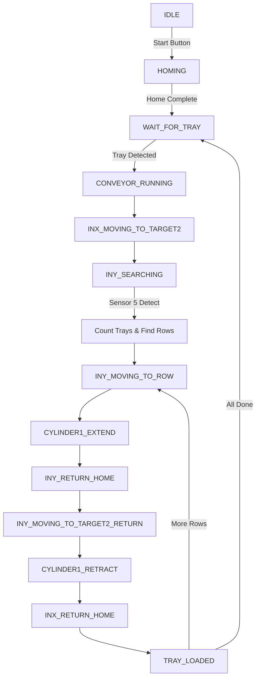
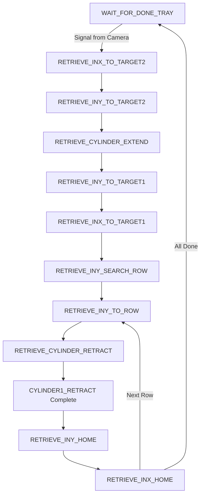

# 📋 MÔ TẢ HỆ THỐNG NẠP CARTRIDGE

## 🎯 Tổng Quan Hệ Thống

Hệ thống tự động nạp cartridge với **5 servo motors** Festo CMMT-AS và **2 xi lanh** khí nén, điều khiển qua ROS 2.

### **Chức năng chính:**
1. **State 1**: Lấy khay đầu vào (Input Tray) từ conveyor
2. **State 2**: Lấy lại khay đã xử lý (Retrieved Tray) 
3. **State 3**: *(Đã tắt)* - Xử lý khay đầu ra

---

## 🏗️ Kiến Trúc Phần Cứng

### **5 Servo Motors (Festo CMMT-AS-C2-3A-MP-S1)**

```
┌─────────────────────────────────────────────────────────────┐
│                    HỆ THỐNG SERVO                           │
├─────────────────────────────────────────────────────────────┤
│                                                             │
│  SERVO 1 - InX (192.168.27.247)                            │
│  └─ Trục X đầu vào - Di chuyển ngang để lấy khay           │
│                                                             │
│  SERVO 2 - InY (192.168.27.248)                            │
│  └─ Trục Y đầu vào - Di chuyển dọc để chọn hàng (row)      │
│                                                             │
│  SERVO 3 - Put Tray (192.168.27.103)                       │
│  └─ Đẩy khay - Đẩy khay ra vị trí cho robot lấy           │
│                                                             │
│  SERVO 4 - OutX (192.168.27.104)                           │
│  └─ Trục X đầu ra - Di chuyển ngang để lấy khay đã xử lý   │
│                                                             │
│  SERVO 5 - OutY (192.168.27.105)                           │
│  └─ Trục Y đầu ra - Di chuyển dọc để đặt khay vào stack    │
│                                                             │
└─────────────────────────────────────────────────────────────┘
```

### **IO Module**
```
┌─────────────────────────────────────────────────────────────┐
│         FESTO CPX-AP (192.168.27.254)                       │
├─────────────────────────────────────────────────────────────┤
│                                                             │
│  INPUTS (Sensors):                                         │
│   • Sensor 1-15: Cảm biến vị trí, khay, an toàn            │
│   • Sensor 5: Phát hiện khay trên InY (đếm stack)          │
│                                                             │
│  OUTPUTS (Cylinders):                                      │
│   • Channel 4: Cylinder 1 Retract (rút)                    │
│   • Channel 5: Cylinder 1 Extend (đẩy)                     │
│   • Channel 6: Cylinder 2 Retract (rút)                    │
│   • Channel 7: Cylinder 2 Extend (đẩy)                     │
│                                                             │
└─────────────────────────────────────────────────────────────┘
```

### **Giao Tiếp**
```
Protocol: Modbus TCP/IP
Network: 192.168.27.x
Servo Control: MotionHandler API
IO Control: CpxAp API
```

---

## 🔄 State Machine - Luồng Hoạt Động

### **STATE 1: Nạp Khay Đầu Vào (Input Tray Loading)**



### **Chi Tiết Các State:**

#### **1. IDLE → HOMING**
```
Điều kiện: Nhấn nút start
Hành động:
  - Home tất cả 5 servos
  - Chờ tất cả hoàn thành
  - Check referenced status
```

#### **2. WAIT_FOR_TRAY**
```
Điều kiện: Đợi khay mới từ conveyor
Hành động:
  - Chờ sensor phát hiện khay
  - Khi phát hiện → CONVEYOR_RUNNING
```

#### **3. CONVEYOR_RUNNING → INX_MOVING_TO_TARGET2**
```
Hành động:
  - InX di chuyển đến vị trí lấy khay (inx_target2)
  - Kiểm tra InY ở vị trí an toàn (collision avoidance)
```

#### **4. INY_SEARCHING**
```
Hành động:
  - InY jog với tốc độ thấp (iny_search_velocity)
  - Sensor 5 phát hiện khay đầu tiên
  - Đọc vị trí hiện tại
  - Tìm row gần nhất trong bảng row_positions[] (YAML)
  - Lưu lại row number này
  - ✅ Ngay khi phát hiện → chuyển sang INY_MOVING_TO_ROW
  - ⚠️ KHÔNG đếm stack, chỉ tìm row đầu tiên
```

#### **5. INY_MOVING_TO_ROW(n)**
```
Logic:
  - Lần đầu tiên: Di chuyển đến row đã phát hiện (từ step 4)
  - Các lần sau: Di chuyển đến row kế tiếp (current_row + 1)
  - Vị trí: Sử dụng row_positions[current_row] từ YAML
  
Hành động:
  - Di chuyển InY đến vị trí row_positions[current_row]
  - Độ chính xác: ±position_tolerance (5mm)
  - Lưu lại current_row để lần chạy tiếp theo biết row nào
  
Vòng lặp:
  - State 1 lần 1: Row đã phát hiện
  - State 2 lần 1: current_row + 1
  - State 2 lần 2: current_row + 2
  - ... cho đến hết khay (max 8 rows)
```

#### **6. CYLINDER1_EXTEND**
```
Hành động:
  - Mở xi lanh 1 để lấy cartridges từ row hiện tại
  - Timeout: cylinder_timeout (5s)
```

#### **7. INY_RETURN_HOME → CYLINDER1_RETRACT**
```
Hành động:
  - InY về home (iny_home = 0)
  - InY di chuyển đến target2 (iny_target2)
  - Rút xi lanh 1
```

#### **8. INX_RETURN_HOME**
```
Hành động:
  - InX về home (inx_home = 0)
  - Kiểm tra InY đã ở vị trí an toàn (collision avoidance)
```

#### **9. TRAY_LOADED**
```
Kiểm tra:
  - Còn row chưa xử lý? → Quay lại INY_MOVING_TO_ROW
  - Đã xong tất cả? → WAIT_FOR_TRAY (chờ khay mới)
```

---

### **STATE 2: Lấy Lại Khay Đã Xử Lý (Retrieved Tray)**



### **Chi Tiết State 2:**

#### **Trigger:**
```
Signal: /cartridge/load_tray_input (từ camera/robot)
Điều kiện: Khay đã xử lý xong, sẵn sàng lấy về
```

#### **Flow:**
1. **RETRIEVE_INX_TO_TARGET2**: InX di chuyển đến vị trí lấy khay
2. **RETRIEVE_INY_TO_TARGET2**: InY di chuyển đến vị trí lấy
3. **RETRIEVE_CYLINDER_EXTEND**: Mở xi lanh để lấy khay
4. **RETRIEVE_INY_TO_TARGET1**: InY về vị trí an toàn
5. **RETRIEVE_INX_TO_TARGET1**: InX về vị trí an toàn
6. **RETRIEVE_INY_SEARCH_ROW**: InY tìm kiếm row để đặt lại
7. **RETRIEVE_INY_TO_ROW**: Di chuyển đến row position
8. **RETRIEVE_CYLINDER_RETRACT**: Rút xi lanh (đặt cartridge)
9. **RETRIEVE_INY_HOME**: InY về home
10. **RETRIEVE_INX_HOME**: InX về home

---

## 🎮 ROS 2 Topics

### **Subscribed Topics:**
```yaml
/revpi/start_button:
  Type: std_msgs/Bool
  Mô tả: Nút start hệ thống (IDLE → HOMING)

/cartridge/load_tray_input:
  Type: std_msgs/Bool
  Mô tả: Signal từ camera - trigger State 2 (lấy khay đã xử lý)

/cartridge/load_tray_output:
  Type: std_msgs/Bool
  Mô tả: Signal từ camera - trigger State 3 (đã tắt)
```

### **Published Topics:**
```yaml
/cartridge/system_state:
  Type: std_msgs/String
  Mô tả: Trạng thái hiện tại của hệ thống
  
/cartridge/current_row:
  Type: std_msgs/Int32
  Mô tả: Row hiện tại đang xử lý
  
/cartridge/detected_trays:
  Type: std_msgs/Int32
  Mô tả: Số lượng khay phát hiện được trong stack
```

---

## 📐 Vị Trí & Tọa Độ

### **Servo 1 - InX (Trục X Đầu Vào)**
```
Home:     0.0 mm
Target2:  500.0 mm (Vị trí khay đầu vào) ⚠️ CẦN ĐO
```

### **Servo 2 - InY (Trục Y Đầu Vào)**
```
Home:     0.0 mm
Target2:  200.0 mm (Vị trí an toàn cho InX) ⚠️ CẦN ĐO

Row Positions (Bảng 8 hàng):
  Row 1:  250.0 mm  ⚠️ CẦN ĐO
  Row 2:  300.0 mm  ⚠️ CẦN ĐO
  Row 3:  350.0 mm  ⚠️ CẦN ĐO
  Row 4:  400.0 mm  ⚠️ CẦN ĐO
  Row 5:  450.0 mm  ⚠️ CẦN ĐO
  Row 6:  500.0 mm  ⚠️ CẦN ĐO
  Row 7:  550.0 mm  ⚠️ CẦN ĐO
  Row 8:  600.0 mm  ⚠️ CẦN ĐO
```

### **Servo 3 - Put Tray (Đẩy Khay)**
```
Home:          0.0 mm
Push Position: 300.0 mm (Vị trí đẩy cho robot) ⚠️ CẦN ĐO
```

### **Servo 4 - OutX (Trục X Đầu Ra)**
```
Home:     0.0 mm
Target1:  100.0 mm (Vị trí an toàn)
Target2:  400.0 mm (Vị trí khay đã xử lý) ⚠️ CẦN ĐO
```

### **Servo 5 - OutY (Trục Y Đầu Ra)**
```
Home:     0.0 mm
Target1:  50.0 mm  (Vị trí an toàn)
Target2:  300.0 mm (Vị trí stack) ⚠️ CẦN ĐO
```

---

## 🛡️ Collision Avoidance (Tránh Va Chạm)

### **Rule 1: InY Safe for InX**
```python
InY position <= iny_safe_position_threshold (50mm)
→ InX có thể di chuyển an toàn
```

### **Rule 2: OutX Safe for OutY**
```python
OutX position <= outx_safe_position_threshold (100mm)
→ OutY có thể di chuyển an toàn
```

### **Kiểm tra trước khi di chuyển:**
- `is_iny_safe_for_inx_move()` → Kiểm tra trước khi InX move
- `is_outx_safe_for_outy_move()` → Kiểm tra trước khi OutY move

---

## ⚙️ Thông Số Vận Hành

### **Velocities (Tốc độ)**
```yaml
Servo 3 Jog:        50 mm/s   (Push tray)
InY Search:         30 mm/s   (Tìm row - chậm để chính xác)
Default Position:   300 mm/s  (Di chuyển thông thường)
```

### **Tolerances (Dung sai)**
```yaml
Position Tolerance: ±5.0 mm   (Cho phép sai số vị trí)
```

### **Timeouts (Thời gian chờ tối đa)**
```yaml
Homing:    30 seconds
Move:      20 seconds
Cylinder:  5 seconds
```

### **System Limits**
```yaml
Max Trays per Stack:        8 trays
Max Slots per Output Tray:  9 slots
1 Slot = 1 Batch = 8 cartridges từ input trays
```

---

## 🔌 API & Protocol

### **Communication Protocol**
```
Servo Control:
  - Protocol: Modbus TCP
  - Library: edcon.edrive.com_modbus.ComModbus
  - Handler: edcon.edrive.motion_handler.MotionHandler

IO Module Control:
  - Protocol: EtherNet/IP
  - Library: cpx_io.cpx_system.cpx_ap.cpx_ap.CpxAp
```

### **Key API Methods**

#### **Servo Control:**
```python
# Connection
com = ComModbus(ip)
mot = MotionHandler(com)

# Initialization
mot.acknowledge_faults()
mot.enable_powerstage()

# Homing
mot.referencing_task()  # Blocking

# Position Move
mot.position_task(
    position=100000,    # μm (100mm)
    velocity=300000,    # μm/s (300mm/s)
    absolute=True,
    nonblocking=False
)

# Velocity Move (Jog)
mot.velocity_task(
    velocity=50000,     # μm/s (50mm/s)
    duration=10.0,      # seconds
    nonblocking=True
)

# Read Position
pos_um = mot.get_actual_position()  # Returns μm

# Check Status
is_homed = mot.referenced()
```

#### **IO Module:**
```python
# Connection
io = CpxAp(ip_address="192.168.27.254")
io.__enter__()

# Read Sensor
state = io.get_channel(sensor_id)

# Control Cylinder
io.set_channel(channel_id)      # Activate
io.reset_channel(channel_id)    # Deactivate
```

---

## 📊 Workflow Tổng Thể

```
┌──────────────────────────────────────────────────────────┐
│                    SYSTEM STARTUP                         │
└────────────────┬─────────────────────────────────────────┘
                 │
                 ▼
          ┌──────────┐
          │   IDLE   │
          └─────┬────┘
                │ Start Button
                ▼
          ┌──────────┐
          │  HOMING  │ ← Home tất cả 5 servos
          └─────┬────┘
                │
    ┌───────────┴───────────┐
    │                       │
    ▼                       ▼
┌─────────────┐      ┌──────────────────┐
│   STATE 1   │      │     STATE 2      │
│ Input Tray  │      │ Retrieved Tray   │
│             │      │                  │
│ • Conveyor  │      │ • Camera Signal  │
│ • InX→Tray  │      │ • Get Done Tray  │
│ • InY→Rows  │      │ • Return to Rows │
│ • Cylinder1 │      │ • Cylinder1      │
└─────────────┘      └──────────────────┘
```

---

## 🎯 Tóm Tắt Chức Năng

### **Hệ thống thực hiện:**

1. **Tự động nhận khay** từ conveyor
2. **Phát hiện số lượng khay** trong stack (1-8 trays)
3. **Lấy cartridges từng row** một cách tuần tự
4. **Tránh va chạm** giữa các trục
5. **Lấy lại khay đã xử lý** khi có tín hiệu
6. **Đặt lại vào đúng row** ban đầu

### **Điểm mạnh:**
✅ State machine rõ ràng, dễ debug  
✅ Collision avoidance tự động  
✅ Flexible: Hỗ trợ 1-8 khay/stack  
✅ Error handling với traceback  
✅ Config YAML dễ điều chỉnh  

### **Cấu hình linh hoạt:**
⚙️ Positions qua YAML file  
⚙️ Velocities có thể điều chỉnh  
⚙️ Timeouts có thể tùy chỉnh  
⚙️ Safety thresholds configurable  

---

**📄 Xem thêm:**
- `CONFIG_GUIDE.md` - Hướng dẫn cấu hình
- `YAML_CONFIG_SUMMARY.md` - Tổng quan YAML
- `FESTO_API_FIX_SUMMARY.md` - API reference

**🚀 Sẵn sàng vận hành!**
