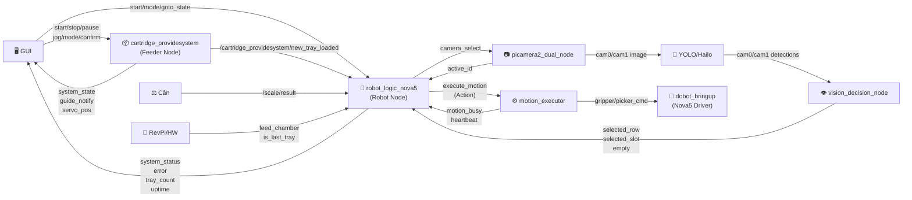

# 🗺️ SYSTEM NODES & TOPICS — Cartridge Filling Machine
> Cập nhật: 2026-03-17 | ROS 2 Humble | RPi5

---

## 📦 Danh Sách Node Hoạt Động

| Node | File | Ngôn ngữ | Mô tả |
|------|------|----------|-------|
| `cartridge_providesystem` | `system_feed_cartridge/scripts/cartridge_providesystem_py_node.py` | Python | Điều khiển feeder (Festo servo + cylinder) — chạy trên **RPi5** |
| `robot_logic_nova5` | `robot_control_main/src/robot_logic_node.cpp` | C++ | State machine chính của robot Nova5 |
| `vision_decision_node` | `robot_control_main/src/vision_decision_node.cpp` | C++ | Xử lý kết quả AI → quyết định row/slot |
| `motion_executor` | `robot_control_main/src/motion_executor.cpp` | C++ | Thực thi lệnh chuyển động Dobot |
| `picamera2_dual_node` | `csi_camera/scripts/picamera2_dual_node.py` | Python | Stream dual CSI camera (Picamera2) |
| `yolo_ros_hailort_cpp` | `YOLO-HailoRT-ROS2/yolo_ros_hailort_cpp/` | C++ | Inference YOLO trên Hailo-8L NPU |
| `dobot_bringup` | `DOBOT_6Axis_ROS2_V3/dobot_bringup_v3/` | C++ | Driver Dobot Nova5 (services) |
| `nova5_gui` / `unified_control_gui` | `nova5_gui/` / `unified_control_gui/` | C++/QML | GUI điều khiển Qt/QML |

---

## 🔗 Topic Map Toàn Hệ Thống

### 🟢 SYSTEM CONTROL

| Topic | Type | Publisher | Subscriber | Mô tả |
|-------|------|-----------|------------|-------|
| `/system/start_button` | `Bool` | GUI | `robot_logic_nova5`, `cartridge_providesystem` | Nút START |
| `/system/stop_button` | `Bool` | GUI | `cartridge_providesystem` | Nút STOP |
| `/system/pause_button` | `Bool` | GUI | `cartridge_providesystem` | Nút PAUSE |
| `/robot/set_mode` | `Int32` | GUI | `robot_logic_nova5` | Mode: 1=AUTO, 2=AI, 3=MANUAL |
| `/robot/goto_state` | `String` | GUI | `robot_logic_nova5` | Jump to state (manual debug) |
| `/robot/command/change_tray` | `Bool` | GUI | `robot_logic_nova5` | Lệnh thay khay thủ công |

---

### 🤖 ROBOT LOGIC NODE (`robot_logic_nova5`)

#### 📥 Subscribe
| Topic | Type | Nguồn | Mô tả |
|-------|------|-------|-------|
| `/system/start_button` | `Bool` | GUI | Bắt đầu hệ thống |
| `/cartridge_providesystem/new_tray_loaded` | `Bool` | `cartridge_providesystem` | Khay mới đã nạp |
| `/revpi/feed_chamber` | `Bool` | RevPi/HW | Buồng sẵn sàng nạp |
| `/revpi/is_last_tray` | `Bool` | RevPi/HW | Tín hiệu khay cuối |
| `/fill_machine/fill_done` | `Bool` | Filling station | Đã đổ đầy xong |
| `/scale/result` | `Bool` | Cân | Kết quả cân (pass/fail) |
| `/vision/input_tray/selected_row` | `Int32` | `vision_decision_node` | Row khay đầu vào đã chọn |
| `/vision/input_tray/empty` | `Bool` | `vision_decision_node` | Khay đầu vào rỗng |
| `/vision/output_tray/selected_slot` | `Int32` | `vision_decision_node` | Slot đầu ra đã chọn |
| `/camera/ai/selected_row` | `Int32` | Camera/AI | Row từ AI |
| `/camera/ai/selected_slot` | `Int32` | Camera/AI | Slot từ AI |
| `/camera/active_id` | `Int32` | `picamera2_dual_node` | Camera nào đang active |
| `/robot/command_camera` | `Int32` | GUI | Chuyển camera thủ công |
| `/robot/command_row` | `Int32` | GUI | Chọn row thủ công |
| `/robot/command_slot` | `Int32` | GUI | Chọn slot thủ công |
| `/robot/motion_busy` | `Bool` | `motion_executor` | Motion đang chạy |
| `/robot/motion_heartbeat` | `Header` | `motion_executor` | Heartbeat motion executor |
| `/vision/heartbeat` | `Header` | `vision_decision_node` | Heartbeat vision node |
| `/cartridge/busy` | `Bool` | - | Feeder đang bận (interlock) |

#### 📤 Publish
| Topic | Type | Subscriber | Mô tả |
|-------|------|------------|-------|
| `/robot/system_status` | `String` | GUI | Trạng thái state machine |
| `/robot/error` | `String` | GUI | Thông báo lỗi |
| `/robot/system_uptime` | `String` | GUI | Uptime hệ thống (HH:MM:SS) |
| `/robot/tray_count` | `Int32` | GUI | Số khay đã xử lý |
| `/robot/selected_input_row` | `Int32` | GUI, vision | Row đầu vào đang xử lý |
| `/robot/selected_output_slot` | `Int32` | GUI, vision | Slot đầu ra đang đặt |
| `/robot/gripper_cmd` | `Bool` | `motion_executor` | Lệnh gripper |
| `/robot/picker_cmd` | `Bool` | `motion_executor` | Lệnh picker |
| `/robot/camera_select` | `Int32` | `picamera2_dual_node` | Chọn camera |
| `/camera/status` | `String` | GUI | Trạng thái camera |
| `/robot/change_tray` | `Bool` | `cartridge_providesystem` | Trigger thay khay |
| `/robot/done_tray_output` | `Bool` | GUI | Khay output xong |
| `/robot/place_done` | `Bool` | GUI/vision | Đặt cartridge xong |
| `/robot/last_batch_complete` | `Bool` | GUI | Batch cuối hoàn tất |
| `/robot/motion_busy` | `Bool` | `robot_logic_nova5` | Đang chuyển động |

#### 🔧 Services (Call)
| Service | Type | Mô tả |
|---------|------|-------|
| `/nova5/dobot_bringup/EnableRobot` | `EnableRobot` | Bật robot |
| `/nova5/dobot_bringup/ClearError` | `ClearError` | Xóa lỗi |
| `/nova5/dobot_bringup/DO` | `DO` | Set digital output |
| `/nova5/dobot_bringup/RobotMode` | `RobotMode` | Lấy mode robot |
| `/robot/execute_motion` | Action `ExecuteMotion` | Thực thi motion |

#### 🔧 Services (Serve)
| Service | Type | Mô tả |
|---------|------|-------|
| `/robot/enable_system` | `SetBool` | Enable/disable hệ thống |
| `/robot/emergency_stop` | `SetBool` | Dừng khẩn |
| `/robot/reset_state` | `SetBool` | Reset state machine |

---

### ⚙️ MOTION EXECUTOR (`motion_executor`)

#### 📥 Subscribe
| Topic | Type | Mô tả |
|-------|------|-------|
| Action `/robot/execute_motion` | `ExecuteMotion` | Nhận lệnh motion từ robot_logic |

#### 📤 Publish
| Topic | Type | Mô tả |
|-------|------|-------|
| `/robot/motion_busy` | `Bool` | Đang chuyển động |
| `/robot/motion_heartbeat` | `Header` | Heartbeat |
| `/robot/gripper_cmd` | `Bool` | Điều khiển gripper |
| `/robot/picker_cmd` | `Bool` | Điều khiển picker |

---

### 👁️ VISION DECISION NODE (`vision_decision_node`)

#### 📥 Subscribe
| Topic | Type | Mô tả |
|-------|------|-------|
| `/camera/cam0/detections` | `Detection2DArray` | YOLO kết quả cam0 (input tray) |
| `/camera/cam1/detections` | `Detection2DArray` | YOLO kết quả cam1 (output tray) |
| `/robot/set_mode` | `Int32` | Mode hoạt động |
| `/robot/place_done` | `Bool` | Robot đặt xong → update slot |

#### 📤 Publish
| Topic | Type | Mô tả |
|-------|------|-------|
| `/vision/input_tray/selected_row` | `Int32` | Row khay đầu vào |
| `/vision/input_tray/empty` | `Bool` | Khay đầu vào rỗng |
| `/vision/output_tray/selected_slot` | `Int32` | Slot đầu ra |
| `/vision/heartbeat` | `Header` | Heartbeat |
| `/robot/change_tray_input` | `Bool` | Trigger thay khay vào |
| `/robot/change_tray_output` | `Bool` | Trigger thay khay ra |
| `/vision/input_tray/row_status` | `Int32MultiArray` | Trạng thái toàn bộ rows |
| `/vision/output_tray/slot_status` | `Int32MultiArray` | Trạng thái toàn bộ slots |

---

### 📡 CARTRIDGE FEEDER (`cartridge_providesystem`)

#### 📥 Subscribe
| Topic | Type | Mô tả |
|-------|------|-------|
| `/system/start_button` | `Bool` | Nút START |
| `/system/stop_button` | `Bool` | Nút STOP |
| `/system/pause_button` | `Bool` | Nút PAUSE |
| `/providesystem/gui_confirm` | `String` | GUI xác nhận thủ công |
| `/providesystem/jog_cmd` | `String` | Lệnh JOG thủ công |
| `/providesystem/change_tray_input` | `String` | Thay khay thủ công |
| `/providesystem/set_operation_mode` | `String` | Đổi auto/manual |
| `/providesystem/goto_state` | `String` | Nhảy vào state cụ thể |
| `/robot/done_tray_output` | `Bool` | `robot_logic_nova5` / `vision_decision_node` | **State 4 trigger** — khay output đầy |

#### 📤 Publish
| Topic | Type | Mô tả |
|-------|------|-------|
| `/system_state` | `String` | State machine hiện tại |
| `/cartridge_providesystem/new_tray_loaded` | `Bool` | Đã nạp khay → robot bắt đầu |
| `/providesystem/gui_notify` | `String` | Thông báo lên GUI |
| `/providesystem/servo_positions` | `String` | Vị trí servo realtime |

---

### 📷 CAMERA NODE (`picamera2_dual_node`)

#### 📥 Subscribe
| Topic | Type | Mô tả |
|-------|------|-------|
| `/robot/camera_select` | `Int32` | Chọn camera active |

#### 📤 Publish
| Topic | Type | Mô tả |
|-------|------|-------|
| `/camera/cam0/image_raw` | `Image` | Stream cam0 (input tray) |
| `/camera/cam1/image_raw` | `Image` | Stream cam1 (output tray) |
| `/camera/active_id` | `Int32` | Camera đang active |

---

### 🧠 YOLO / AI NODE (`yolo_ros_hailort_cpp`)

#### 📥 Subscribe
| Topic | Type | Mô tả |
|-------|------|-------|
| `/camera/cam0/image_raw` | `Image` | Frame cam0 |
| `/camera/cam1/image_raw` | `Image` | Frame cam1 |

#### 📤 Publish
| Topic | Type | Mô tả |
|-------|------|-------|
| `/camera/cam0/detections` | `Detection2DArray` | Bounding boxes cam0 |
| `/camera/cam1/detections` | `Detection2DArray` | Bounding boxes cam1 |

---

## 🗺️ Sơ Đồ Luồng Tổng Thể

---

## 📋 Topics Quan Trọng Kết Nối Feeder ↔ Robot

> **Ghi chú thiết kế:** State 1 (nạp khay mới) và State 2 (thay khay output) là **một vòng kín khép kín**:
> - State 1 hoàn tất → pub `/cartridge_providesystem/new_tray_loaded` → Robot bắt đầu pick
> - State 2 hoàn tất → Feeder tự động quay lại **State 1** (nạp khay tiếp)
> → **Chỉ cần 1 topic `/cartridge_providesystem/new_tray_loaded`** để đồng bộ Feeder ↔ Robot trong auto mode.

| Topic | Direction | Ý nghĩa |
|-------|-----------|----------|
| `/cartridge_providesystem/new_tray_loaded` | **Feeder → Robot** | State 1 xong: khay mới đã nạp, robot được phép bắt đầu pick |
| `/system/start_button` | GUI → Cả hai | Khởi động hệ thống |

> **Lưu ý:** `cartridge_providesystem` chạy trên **RPi5** (cùng máy với robot node), không phải RevPi. RevPi chỉ là tên convention cho topic hardware signal.
